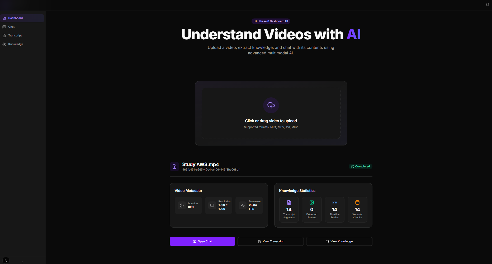
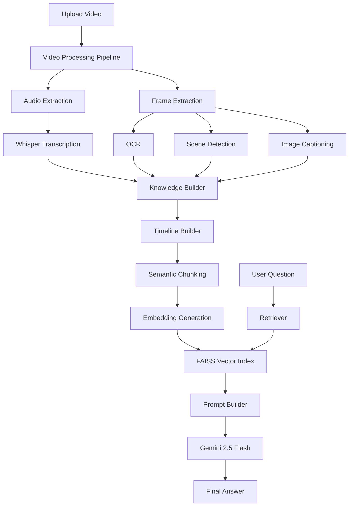
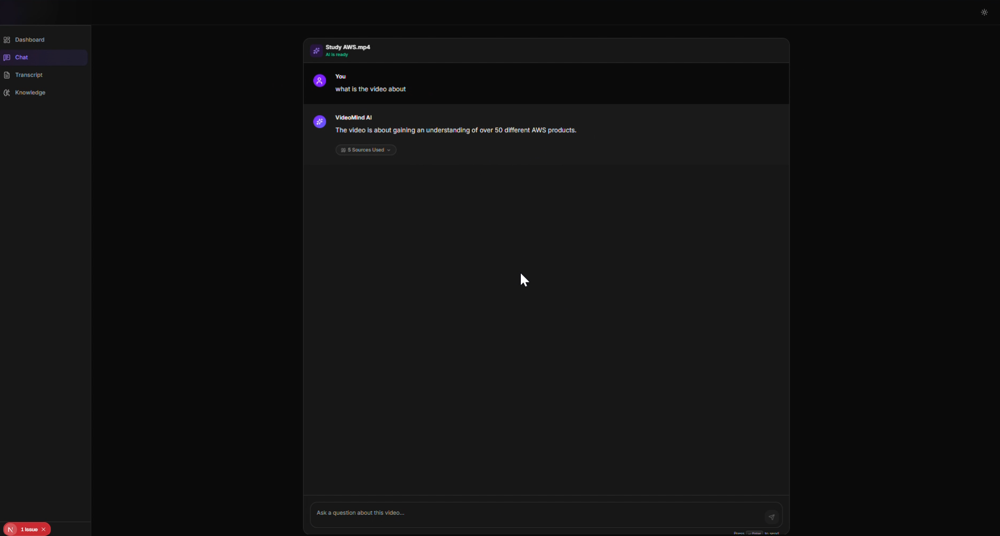
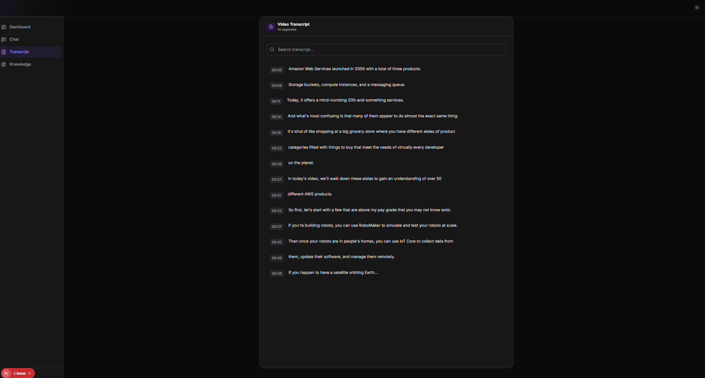
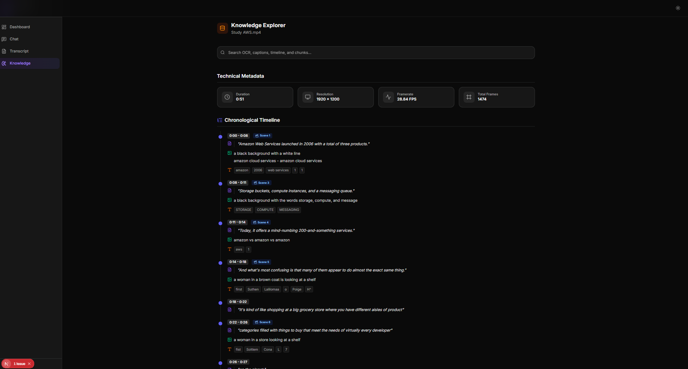
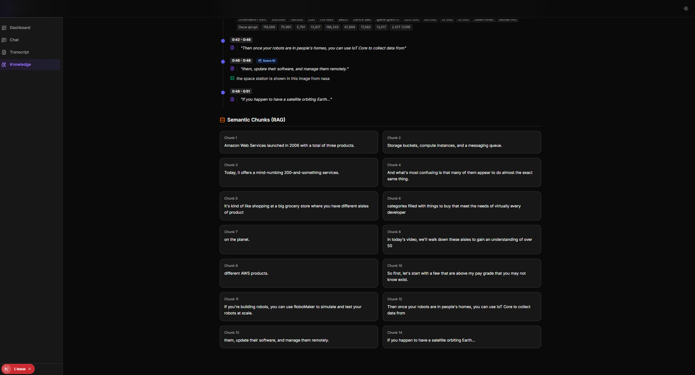

# 🎥 VideoMind AI

> **Transform any video into a searchable, multimodal AI knowledge base that you can chat with.**

VideoMind AI is a full-stack, multimodal AI application that understands videos by combining **speech recognition, computer vision, semantic search, and Retrieval-Augmented Generation (RAG)**.

Upload a video once, and the system automatically:

- 🎙️ Transcribes spoken audio
- 👁️ Extracts on-screen text using OCR
- 🖼️ Generates image captions
- 🎬 Detects scene boundaries
- 🧠 Builds a structured semantic knowledge base
- 🔎 Indexes content using FAISS vector search
- 🤖 Lets you chat naturally with your video's content using Gemini 2.5 Flash through a Retrieval-Augmented Generation (RAG) pipeline

The goal is to make long videos instantly searchable and conversational.

---

# ✨ Key Highlights

- 🎥 End-to-end multimodal AI pipeline
- 🤖 Gemini-powered Retrieval-Augmented Generation (RAG)
- 🎙️ Automatic speech transcription with Whisper
- 👁️ OCR for extracting on-screen text
- 🖼️ AI-generated image captions
- 🎬 Scene detection and timeline creation
- 🧠 Semantic chunking and vector embeddings
- 🔎 FAISS-powered semantic search
- ⚡ FastAPI backend + Next.js frontend
- 🌙 Modern responsive UI built with shadcn/ui

- # 🎥 Demo

📺 Watch the demo: https://drive.google.com/file/d/17EtJS-2tnIxKcaMeBCX12L8knDeNDwjH/view?usp=sharing
---

# 🏗️ System Architecture


---

# 🎯 Project Goals

VideoMind AI was built to explore how multiple AI technologies can be combined into a single end-to-end application.

The project integrates:

- Automatic Speech Recognition (Whisper)
- Computer Vision (OCR & Image Captioning)
- Semantic Search (FAISS)
- Large Language Models (Gemini)
- Retrieval-Augmented Generation (RAG)

The result is an AI assistant capable of understanding and answering questions about video content through natural language.
---

# 🔄 Processing Pipeline

```text
Upload Video
      │
      ▼
Extract Audio
      │
      ▼
Whisper Speech Recognition
      │
      ▼
Extract Frames
      │
      ▼
OCR
      │
      ▼
Scene Detection
      │
      ▼
Image Captioning
      │
      ▼
Knowledge Builder
      │
      ▼
Timeline Generation
      │
      ▼
Semantic Chunking
      │
      ▼
Embeddings
      │
      ▼
FAISS Index
      │
      ▼
Retriever
      │
      ▼
Gemini RAG Chat
```

---

# 🚀 Features

## 🎥 Video Processing

- Video upload and validation
- Automatic workspace creation
- Metadata extraction
- Optimized frame sampling
- Audio extraction

---

## 🧠 Artificial Intelligence

### Speech Intelligence

- Faster-Whisper Small speech-to-text transcription

### Vision Intelligence

- OCR using EasyOCR
- Image caption generation
- Scene detection

### Knowledge Intelligence

- Timeline creation
- Semantic chunking
- Embedding generation
- FAISS vector database

### Conversational AI

- Gemini 2.5 Flash powered Retrieval-Augmented Generation (RAG)

---

## 💻 Frontend

- Modern Dashboard
- Workspace management
- Upload interface
- Processing dashboard
- Transcript Viewer
- Knowledge Explorer
- AI Chat Interface
- Responsive design
- Dark mode support

---

# 🛠️ Technology Stack

## Frontend

- Next.js v24.18.0
- React
- TypeScript
- Tailwind CSS v4
- shadcn/ui
- Axios
- Lucide Icons

---

## Backend

- FastAPI
- Python 3.11.4
- OpenCV
- FFmpeg

---

## 🤖 AI Models

| Purpose | Model |
|----------|-------|
| Speech Recognition | Faster-Whisper Small |
| Image Captioning | BLIP |
| OCR | EasyOCR |
| Text Embeddings | BAAI/bge-small-en-v1.5 |
| Large Language Model | Gemini 2.5 Flash |

---

## Vector Database

- FAISS

---

# 📸 Screenshots

| Dashboard | Chat |
|------------|------|
|  |  |

---

| Transcript | Knowledge Explorer |
|------------|--------------------|
|  |  |
|  |
---

# ⚡ Performance

The processing pipeline was optimized to reduce unnecessary computation.

### Frame Sampling

Originally:

```
1 frame / second
```

Optimized:

```
1 frame / 5 seconds
```

This significantly reduces OCR, caption generation, and embedding computation while preserving semantic information for lectures and presentations.

---

## 📂 Project Structure

```text
VideoMindAI/
│
├── backend/
│   ├── app/
│   │   ├── api/                 # FastAPI route handlers
│   │   ├── schemas/             # Pydantic request/response models
│   │   ├── services/            # AI processing pipeline
│   │   │   ├── audio_service.py
│   │   │   ├── transcript_service.py
│   │   │   ├── frame_service.py
│   │   │   ├── ocr_service.py
│   │   │   ├── scene_service.py
│   │   │   ├── caption_service.py
│   │   │   ├── knowledge_service.py
│   │   │   ├── timeline_service.py
│   │   │   ├── chunking_service.py
│   │   │   ├── embedding_service.py
│   │   │   ├── vector_service.py
│   │   │   ├── retrieval_service.py
│   │   │   ├── prompt_builder.py
│   │   │   ├── chat_service.py
│   │   │   ├── processing_service.py
│   │   │   ├── video_service.py
│   │   │   └── workspace_service.py
│   │   └── main.py
│   │
│   ├── data/
│   │   └── videos/              # Workspace data for uploaded videos
│   │
│   ├── tests/
│   └── requirements.txt
│
├── frontend/
│   ├── app/
│   │   ├── chat/
│   │   ├── knowledge/
│   │   ├── transcript/
│   │   ├── upload/
│   │   ├── layout.tsx
│   │   └── page.tsx
│   │
│   ├── components/
│   │   ├── chat/
│   │   ├── dashboard/
│   │   ├── knowledge/
│   │   ├── transcript/
│   │   ├── layout/
│   │   └── ui/
│   │
│   ├── context/
│   ├── services/
│   ├── lib/
│   ├── public/
│   └── package.json
│
├── .github/
│   └── workflows/
│
├── README.md
├── LICENSE
└── .gitignore
```

---

## Backend

## Installation & Setup

### 3. Running with Docker (Recommended)

You can run the entire application using Docker Compose.

1. Copy the example environment file:
```bash
cp .env.example .env
```
2. Open `.env` and add your `GEMINI_API_KEY`.
3. Start the containers:
```bash
docker-compose up --build -d
```
The frontend will be available at [http://localhost:3000](http://localhost:3000) and the backend API at [http://localhost:8000](http://localhost:8000).

### 4. Running the Backend (Manual)

#### Windows (PowerShell)
```powershell
cd backend
python -m venv venv
.\venv\Scripts\Activate.ps1
pip install -r requirements.txt
uvicorn app.main:app --reload --port 8000
```

#### macOS / Linux
```powershell
cd backend
python3 -m venv venv
source venv/bin/activate
pip install -r requirements.txt
uvicorn app.main:app --reload --port 8000
```

### 5. Running the Frontend (Manual)

```bash
cd frontend

npm install

npm run dev
```

Application

```
http://localhost:3000
```

---

# 🔌 API Endpoints

| Method | Endpoint | Description |
|----------|----------|-------------|
| GET | `/` | API root endpoint |
| GET | `/health` | Health check |
| POST | `/api/v1/videos/upload` | Upload and process a video |
| POST | `/api/v1/chat` | Ask questions about a processed video using RAG |
| GET | `/api/v1/workspaces/{workspace_id}/transcript` | Retrieve transcript |
| GET | `/api/v1/workspaces/{workspace_id}/knowledge` | Retrieve structured knowledge base |
| GET | `/api/v1/workspaces/{workspace_id}/stats` | Retrieve processing statistics |
---

# 🔮 Future Improvements

- Background processing with Celery/Redis
- Real-time processing progress
- Video player synchronized with transcript
- Clickable timestamps
- Multi-user authentication
- Cloud storage support (AWS S3 / GCS)
- Kubernetes support
- Multi-language transcription
- Streaming video analysis

---

# 📄 License

This project is licensed under the MIT License.

See the **LICENSE** file for details.

---

# 👨‍💻 Author

**Minhal Husain**

B.Tech Computer Science (AI/ML)

Built as a full-stack multimodal AI system demonstrating Retrieval-Augmented Generation (RAG), Computer Vision, Natural Language Processing, and modern web application development.